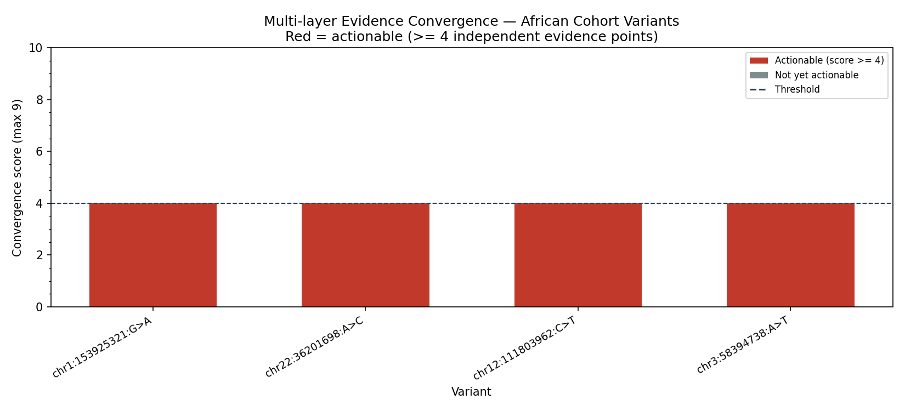

# African Variant Triage Pipeline

A multi-layer computational pipeline that converts African-cohort variants of uncertain significance (VUS) from statistical associations into multi-evidence functional hypotheses, ready for wet-lab prioritisation.

---

## Table of Contents

- [Overview](#overview)
- [Pipeline Architecture](#pipeline-architecture)
- [Project Structure](#project-structure)
- [Installation](#installation)
- [Quick Start](#quick-start)
- [Input Format](#input-format)
- [Usage](#usage)
- [Output Files](#output-files)
- [Evidence Convergence Scoring](#evidence-convergence-scoring)
- [Configuration](#configuration)
- [Module Reference](#module-reference)
- [External APIs](#external-apis)
- [Troubleshooting](#troubleshooting)

---

## Overview

Large-scale African genomic cohort studies (e.g. AWI-Gen, H3Africa, APCDR) routinely identify variants associated with complex traits such as hypertension and chronic kidney disease. Many of these variants are classified as VUS — statistically significant in the discovery cohort but lacking functional annotation to explain *how* they act biologically.

This pipeline addresses that gap by integrating three independent evidence layers:

1. **AlphaGenome** (DeepMind) — deep-learning prediction of regulatory impact from sequence
2. **GTEx + RegulomeDB** — cross-reference against measured eQTL and regulatory element databases
3. **Population genetics** — Hardy-Weinberg equilibrium test and case/control allele frequency enrichment

A variant is flagged as a high-confidence functional candidate only when multiple independent lines of evidence converge on the same biological conclusion. This reduces false positives from any single model or database and produces a ranked, assay-ready shortlist.

---

## Pipeline Architecture

```
VCF input
    │
    ▼
┌─────────────────────────────────────────────────────────────┐
│  Layer 1 — AlphaGenome regulatory prediction                │
│  • Scores REF vs ALT across all recommended scorers         │
│  • Filters to kidney ontology terms (UBERON / CL)           │
│  • Classifies: HIGH / MODERATE / NEUTRAL per quantile       │
└──────────────────────────┬──────────────────────────────────┘
                           │
                           ▼
┌─────────────────────────────────────────────────────────────┐
│  Layer 2 — Cross-reference                                  │
│  2a. GTEx v8 single-tissue eQTL (Kidney Cortex + Medulla)  │
│  2b. RegulomeDB v2 regulatory annotation                    │
│      (rank, TF ChIP, DNase, QTL, footprint)                 │
└──────────────────────────┬──────────────────────────────────┘
                           │
                           ▼
┌─────────────────────────────────────────────────────────────┐
│  Layer 3 — Population genetics                              │
│  • Hardy-Weinberg equilibrium test (χ², 1 d.f.)            │
│  • Case vs control allele frequency enrichment (Δ > 2%)     │
└──────────────────────────┬──────────────────────────────────┘
                           │
                           ▼
┌─────────────────────────────────────────────────────────────┐
│  Evidence convergence scoring                               │
│  • Points awarded per independent evidence signal           │
│  • Actionable threshold: score >= 4 / 9                     │
│  • Wet-lab assay suggestions per variant                    │
└──────────────────────────┬──────────────────────────────────┘
                           │
                           ▼
        CSV reports + convergence plot + (optional) track plot
```

### Convergence Score Chart

Variants scoring ≥ 4 are flagged actionable (red bars).



### Deep-dive Track Plot

REF vs ALT predicted tracks across RNA-seq, ATAC, and CAGE for a single variant (generated when `--deep_dive_variant` is set).


---

## Project Structure

```
african_variant_pipeline/
│
├── config.py               # All constants, thresholds, and API endpoints
├── utils.py                # load_vcf, gtex_variant_id helpers
├── layer1_alphagenome.py   # AlphaGenome scoring, filtering, classification
├── layer2_crossref.py      # GTEx eQTL + RegulomeDB annotation
├── layer3_population.py    # Hardy-Weinberg test + AF enrichment
├── convergence.py          # Evidence scoring, report assembly, action report
├── visualisation.py        # Convergence bar chart + deep-dive track plot
├── main.py                 # CLI entry point — calls each layer in order
├── requirements.txt        # Python dependencies
└── README.md
```

---

## Installation

### 1. Clone this repository

```bash
git clone https://github.com/Meshach-Zm/African-Variant-Triage-Pipeline.git
cd african_variant_pipeline
```

### 2. Install AlphaGenome from source

AlphaGenome is not on PyPI and must be installed directly from DeepMind's repository:

```bash
git clone https://github.com/google-deepmind/alphagenome.git
pip install ./alphagenome
```

### 3. Install remaining dependencies

```bash
pip install -r requirements.txt
```

### 4. Obtain an AlphaGenome API key

Register at [deepmind.google.com/science/alphagenome](https://deepmind.google.com/science/alphagenome) to receive an API key.

### 5. Set up your environment variables

Copy the example env file and add your key:

```bash
cp .env.example .env
```

Then open `.env` and fill in your key:

```
ALPHAGENOME_API_KEY=your_api_key_here
```

The pipeline loads this automatically at startup via `python-dotenv`. The `.env` file is listed in `.gitignore` and will never be committed. Never paste your API key directly into the command line or source code.

---

## Quick Start

With `ALPHAGENOME_API_KEY` set in your `.env` file, no `--api_key` flag is needed:

```bash
# Run on built-in example variants
python main.py

# Run on your own variants
python main.py --vcf my_variants.vcf --output_dir results/

# With a deep-dive track plot for one variant
python main.py --vcf my_variants.vcf --deep_dive_variant rs138493856 --output_dir results/

# Re-run Layers 2 and 3 only (skip AlphaGenome API call)
python main.py --vcf my_variants.vcf --output_dir results/ --skip_alphagenome
```

You can still pass the key explicitly if preferred — it takes precedence over the env var:

```bash
python main.py --api_key YOUR_KEY_HERE --vcf my_variants.vcf
```

---

## Input Format

The pipeline accepts a **tab-separated file** with the following columns:

| Column       | Type    | Description                                        |
| ------------ | ------- | -------------------------------------------------- |
| `variant_id` | string  | rsID or any unique identifier (e.g. `rs138493856`) |
| `CHROM`      | string  | Chromosome with `chr` prefix (e.g. `chr1`)         |
| `POS`        | integer | 1-based position in hg38                           |
| `REF`        | string  | Reference allele                                   |
| `ALT`        | string  | Alternate allele                                   |

### Optional columns for Layer 3 (population genetics)

| Column       | Type    | Description                         |
| ------------ | ------- | ----------------------------------- |
| `N_REF_REF`  | integer | Homozygous reference count in cases |
| `N_REF_ALT`  | integer | Heterozygous count in cases         |
| `N_ALT_ALT`  | integer | Homozygous alternate count in cases |
| `CASE_AF`    | float   | Allele frequency in cases           |
| `CONTROL_AF` | float   | Allele frequency in controls        |

If the optional columns are absent, Layer 3 still runs but marks results as `insufficient_data` rather than raising an error.

### Example VCF

```
variant_id	CHROM	POS	REF	ALT
rs138493856	chr1	153925321	G	A
rs73885319	chr22	36201698	A	C
rs186928913	chr12	111803962	C	T
rs141358937	chr3	58394738	A	T
```

---

## Usage

```
python main.py [-h] --api_key API_KEY [--vcf VCF] [--output_dir OUTPUT_DIR]
               [--deep_dive_variant DEEP_DIVE_VARIANT] [--skip_alphagenome]
```

| Argument              | Required | Default          | Description                                        |
| --------------------- | -------- | ---------------- | -------------------------------------------------- |
| `--api_key`           | Yes      | —                | AlphaGenome API key                                |
| `--vcf`               | No       | built-in example | Path to tab-separated VCF file                     |
| `--output_dir`        | No       | `.`              | Directory for all output files                     |
| `--deep_dive_variant` | No       | —                | `variant_id` for full REF vs ALT track plot        |
| `--skip_alphagenome`  | No       | False            | Skip Layer 1; load cached `kidney_scores_full.csv` |

---

## Output Files

All files are written to `--output_dir` (default: current directory).

| File                         | Description                                                  |
| ---------------------------- | ------------------------------------------------------------ |
| `kidney_scores_full.csv`     | Full AlphaGenome scores filtered to kidney ontology terms    |
| `layer2_cross_reference.csv` | GTEx eQTL and RegulomeDB results per variant                 |
| `layer3_population.csv`      | HWE p-values and allele frequency comparisons                |
| `final_report.csv`           | Merged three-layer results with convergence scores           |
| `convergence_scores.png`     | Bar chart of convergence score per variant                   |
| `tracks_<rsid>.png`          | REF vs ALT track plot (only if `--deep_dive_variant` is set) |

### Example outputs

**Convergence scores** — one bar per variant, red = actionable (score ≥ 4):


**Deep-dive track plot** — REF (muted) vs ALT (vivid) overlaid for RNA-seq, ATAC, and CAGE:


The pipeline also prints a plain-text **action report** to stdout listing actionable variants, their evidence summaries, and suggested wet-lab assays.

---

## Evidence Convergence Scoring

Points are awarded independently across all three layers. The maximum possible score is **9**.

| Evidence signal                              | Points |
| -------------------------------------------- | ------ |
| AlphaGenome quantile score ≥ 0.90 (HIGH)     | +2     |
| AlphaGenome quantile score ≥ 0.70 (MODERATE) | +1     |
| GTEx eQTL found in kidney tissue             | +2     |
| RegulomeDB rank 1x or 2x                     | +1     |
| RegulomeDB TF ChIP-seq + DNase-seq overlap   | +1     |
| RegulomeDB QTL overlap                       | +1     |
| HWE deviation in cases (p < 0.001)           | +1     |
| AF enriched in cases vs controls (Δ > 2%)    | +1     |

A variant is flagged as **actionable** when its convergence score is **≥ 4**. This threshold is configurable via `ACTIONABLE_THRESHOLD` in `config.py`.

### Suggested wet-lab assays

The pipeline suggests assays based on which evidence flags were triggered:

| Evidence flag triggered       | Suggested assay                     |
| ----------------------------- | ----------------------------------- |
| RegulomeDB TF ChIP overlap    | EMSA or CUT&RUN to test TF binding  |
| RegulomeDB DNase or footprint | ATAC-seq on isogenic cell line pair |
| GTEx eQTL found               | Luciferase reporter assay           |
| No specific flags             | Luciferase reporter or ATAC-seq     |

---

## Configuration

All thresholds and constants are centralised in `config.py`. Key settings:

| Constant                | Default                                          | Description                                               |
| ----------------------- | ------------------------------------------------ | --------------------------------------------------------- |
| `KIDNEY_ONTOLOGY_TERMS` | `UBERON:0002113`, `UBERON:0001225`, `CL:0000653` | Ontology terms used to filter AlphaGenome tracks          |
| `GTEX_KIDNEY_TISSUES`   | `Kidney_Cortex`, `Kidney_Medulla`                | GTEx tissue IDs queried for eQTLs                         |
| `THRESHOLD_HIGH`        | `0.90`                                           | AlphaGenome quantile threshold for HIGH impact            |
| `THRESHOLD_MODERATE`    | `0.70`                                           | AlphaGenome quantile threshold for MODERATE impact        |
| `ACTIONABLE_THRESHOLD`  | `4`                                              | Minimum convergence score to flag a variant as actionable |
| `SEQUENCE_LENGTH_KEY`   | `SEQUENCE_LENGTH_1MB`                            | Sequence window passed to AlphaGenome                     |
| `API_PAUSE`             | `0.5`                                            | Seconds between API calls (rate limiting)                 |

To adapt the pipeline to a different tissue, update `KIDNEY_ONTOLOGY_TERMS` and `GTEX_KIDNEY_TISSUES` in `config.py`. No other files need to change.

---

## Module Reference

### `config.py`
Centralised constants. Edit this file to change thresholds, tissues, or API endpoints.

### `utils.py`
- `load_vcf(vcf_path)` — loads and validates the input VCF; falls back to example variants if `None`.
- `gtex_variant_id(chrom, pos, ref, alt)` — formats a GTEx-compatible variant ID string.

### `layer1_alphagenome.py`
- `run_layer1(api_key, vcf)` — initialises the model, scores all variants, filters to kidney tissues, classifies impact. Returns `(dna_model, df_kidney)`.
- `summarise_alphagenome(df)` — collapses to one row per variant (highest absolute quantile score).

### `layer2_crossref.py`
- `run_layer2(vcf)` — runs GTEx and RegulomeDB lookups for every variant. Returns one row per variant.
- `query_gtex_eqtl(variant_id_gtex, rsid)` — queries GTEx API v2; falls back to rsID if formatted ID returns nothing.
- `query_regulomedb(chrom, pos)` — queries RegulomeDB v2; returns rank, probability, and feature flags.

### `layer3_population.py`
- `run_layer3(vcf)` — runs HWE test and AF enrichment check per variant. Gracefully handles missing optional columns.
- `hardy_weinberg_test(n_ref_ref, n_ref_alt, n_alt_alt)` — chi-squared HWE test, returns p-value.

### `convergence.py`
- `build_final_report(ag_summary, l2_df, l3_df)` — merges all layers and computes convergence scores.
- `compute_convergence_score(row)` — awards points per evidence signal; returns `(score, reasons)`.
- `print_action_report(report)` — prints ranked triage summary to stdout with assay suggestions.

### `visualisation.py`
- `plot_convergence(report, output_path)` — bar chart of convergence scores; red bars indicate actionable variants.
- `plot_variant_tracks(dna_model, variant, sequence_length, output_path)` — REF vs ALT overlay for RNA-seq, ATAC, and CAGE tracks.

### `main.py`
CLI entry point. Parses arguments, calls each layer in order, saves outputs, and triggers optional deep-dive.

---

## External APIs

| Service     | Endpoint                                  | Notes                                           |
| ----------- | ----------------------------------------- | ----------------------------------------------- |
| AlphaGenome | DeepMind API (key required)               | Scores regulatory impact from DNA sequence      |
| GTEx        | `https://gtexportal.org/api/v2`           | v1 has been discontinued; this pipeline uses v2 |
| RegulomeDB  | `https://regulomedb.org/regulome-search/` | GRCh38 coordinates; 0-based half-open regions   |

All external calls include a `0.5 s` pause between requests (`API_PAUSE` in `config.py`) to respect rate limits. Timeouts are set to 15 seconds per request.

---

## Troubleshooting

**`FileNotFoundError: --skip_alphagenome set but kidney_scores_full.csv not found`**
Run the pipeline once without `--skip_alphagenome` to generate the cached scores file.

**`WARNING: No kidney-tissue tracks returned. Using full unfiltered scores.`**
AlphaGenome did not return tracks matching the configured ontology terms. The pipeline will fall back to the full score set. Check that `KIDNEY_ONTOLOGY_TERMS` in `config.py` matches the ontology identifiers supported by your AlphaGenome API version.

**GTEx or RegulomeDB API warnings in the log**
Both APIs are queried live during each run. Transient network errors are caught and logged as warnings; the affected variant will have empty Layer 2 fields but the pipeline will continue.

**`VCF is missing required columns: {...}`**
Ensure your input file is tab-separated and contains all five required columns: `variant_id`, `CHROM`, `POS`, `REF`, `ALT`. Lines beginning with `#` are treated as comments and skipped.

**AlphaGenome install fails**
Make sure you clone the repository and install with `pip install ./alphagenome` (local path install), not `pip install alphagenome`.
